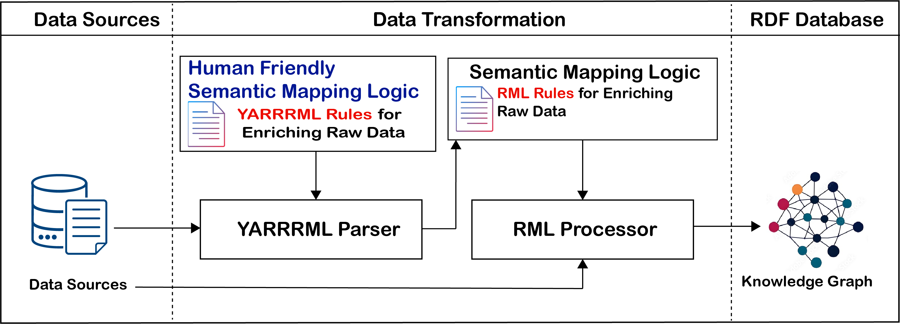

# Use case 1 - Applying YARRRML to enrich CKAN data sets using DCAT vocabulary
## Repository structure
Each folder under [usecase1/src](./src) contains the CKAN metadata statement files, the corresponding YARRRML mapping rules, the intermediary RML file and the generated output in Turtle (TTL) format. 
The input JSON files used in this project were downloaded from the [CKAN example datasets](https://github.com/ckan/ckanext-dcat/tree/master/examples/ckan) in the ckanext-dcat GitHub repository.
The section below provides additional information about the YARRRML mappings and explains how they can be executed to reproduce the results.


## Semantic Enrichment Using YARRRML: A Declarative Mapping Language

The semantic enrichment process via YARRRML involves a few steps. YARRRML rules are defined as the initial step of the semantic enrichment process, using input data and semantic links to standard ontologies as depicted in following figure. These definitions are then converted into RML through the [YARRRML parser](https://github.com/RMLio/yarrrml-parser). Following this conversion, an RML processor, such as [rmlmapper-java](https://github.com/rmlio/rmlmapper-java), transforms the resulting RML rules into RDF.


<div align="center">
  
</div>

## Reproducing the Outputs

To reproduce the provided outputs using the given input data and YARRRML mappings, first clone and set up the YARRRML Parser:
https://github.com/RMLio/yarrrml-parser

Then, run the following commands.
First, convert the YARRRML mapping into an RML mapping by specifying the appropriate paths for both the input mapping file and the generated output files:
```
node bin/parser.js -i mapping.yml -o out.rml.ttl
```
Then, execute the generated RML mapping with [RMLMapper](https://drive.google.com/drive/u/0/folders/1ub0g8ey82oF-6CAI02qOxmc82B0So-qp):
```
java -jar rmlmapper.jar -m out.rml.ttl -o out.ttl
```
The resulting RDF output will be written to out.ttl.


## Key resources 
- [DCAT ↔ CKAN mapping](https://docs.ckan.org/projects/ckanext-dcat/en/latest/mapping/)
- [Ckanext-dcat extension](https://github.com/ckan/ckanext-dcat/tree/master)
- [Data Catalog Vocabulary (DCAT)](https://www.w3.org/TR/vocab-dcat-3/)
- [YARRRML Specification](https://rml.io/yarrrml/spec/)
- [YARRRML Parser](https://github.com/RMLio/yarrrml-parser)
- [Tutorial: generating Linked Data with YARRRML](https://rml.io/yarrrml/tutorial/getting-started/)
- [RML Mapper-Java](https://github.com/rmlio/rmlmapper-java)
