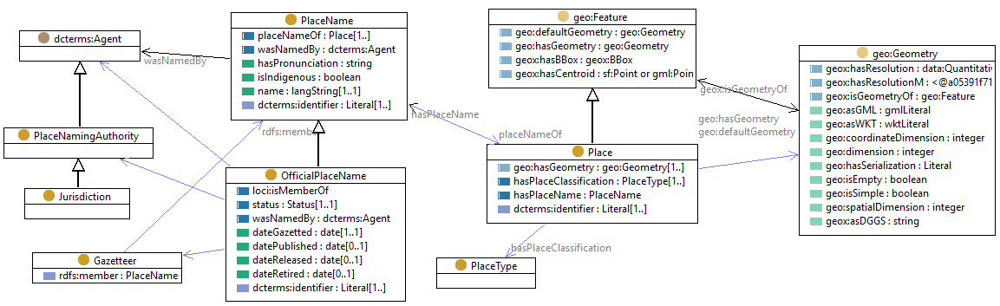

# Use case 2 - Australian placename data
This repository contains source code and datasets for transparent and reusable semantic data enrichment of Australian place names data.  
The approach uses [RML (RDF Mapping Language)](https://rml.io/specs/rml/) to construct two national placenames knowledge graphs from publicly available state-based placenames CSV data: one based on the [Geoscience Australia Placenames Ontology](https://geoscienceaustralia.github.io/Placenames-Ontology/) and the other based on the Geographical Names Model.

The approach uses [RML (RDF Mapping Language)](https://rml.io/specs/rml/) to construct two national placenames knowledge graphs from publicly available state-based placenames CSV data: one based on the [Geoscience Australia Placenames Ontology](https://geoscienceaustralia.github.io/Placenames-Ontology/) and the other based on Spatial Information Queensland’s [Geographical Names Model](https://spatial-information-qld.github.io/geographical-names-model/model.html).

## Key resources 

- [Geoscience Australia Place Names Ontology](https://geoscienceaustralia.github.io/Placenames-Ontology/placenames.html);
- [Geoscience Australia Place-Names GitHub repository](https://github.com/GeoscienceAustralia/Placenames-Ontology);
- [Geographical Names Model](https://spatial-information-qld.github.io/geographical-names-model/model.html);
- [Composite Gazetteer of Australia](https://placenames.fsdf.org.au/);
- [Data Product Specification for the Composite Gazetteer of Australia](data/CompositeGazetteerDPS.pdf);
- [Linked Data API codebase for National Composite Gazetteer of Australia](https://github.com/GeoscienceAustralia/placenames-dataset); and
- [RML tools](https://rml.io/tools/).

## Repository structure

- **data**: Folder with data from official gazetteers and place names.
- **doc**: Project documentation and examples. 
- **lib**: RML processors and dependencies.
- **src**: RML mapping rules for enriching Place Name Data.

## Data

- Gazetteers directly available in the repository for ACT, NSW, NT, QLD, TAS, VIC, and WA.
- For SA only external link available to download official place names gazatteer due to large file size.
- Data downloaded from authoritative organisations (state) for NSW, QLD, SA and VIC.
- For ACT, NT,WA and TAS place names gazetteers were downloaded from the national database, the Composite Gazetteer of Australia. 
- The list of authoritative and non-authoritative organisations for place name gazetteers is available on the [Intergovernmental Committee on Surveying and Mapping (ICSM) website](https://www.icsm.gov.au/individual-state-and-territory-gazetteers).

## Place Name ontology
The below image shows the snapshot of the classes, Object Property (OP), and Data Property (DP) of the [Geoscience Australia Place Name ontology](https://geoscienceaustralia.github.io/Placenames-Ontology/placenames.html). Defined relations in the ontology are used for RML mapping and building PNKG. In the figure below, yellow circles represent classes, blue rectangles indicate object properties, and green rectangles depict data properties.

## Geographical Names Model

  

