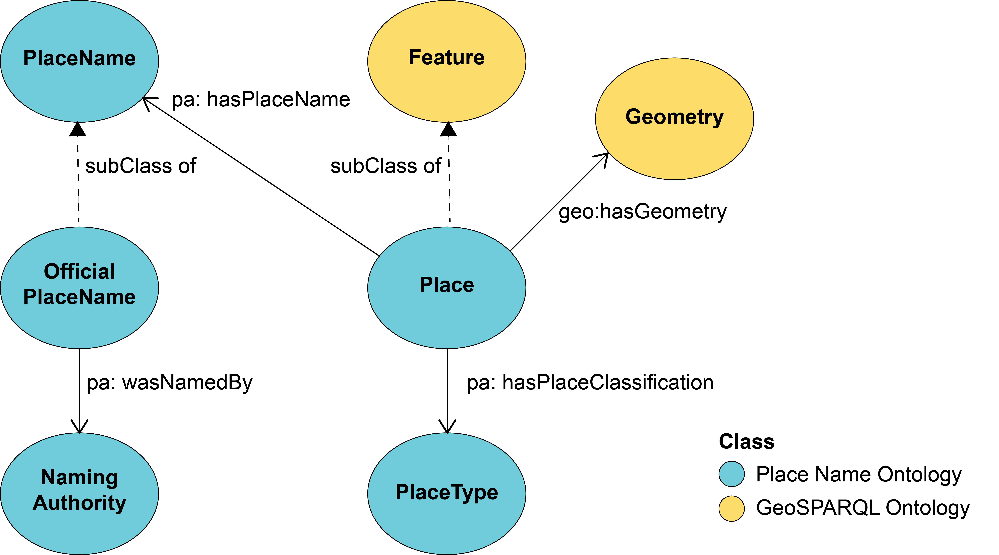
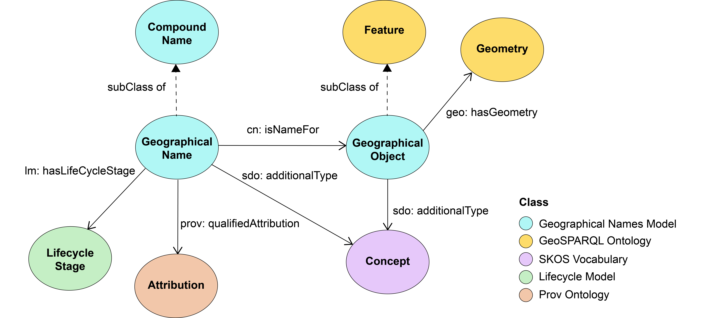
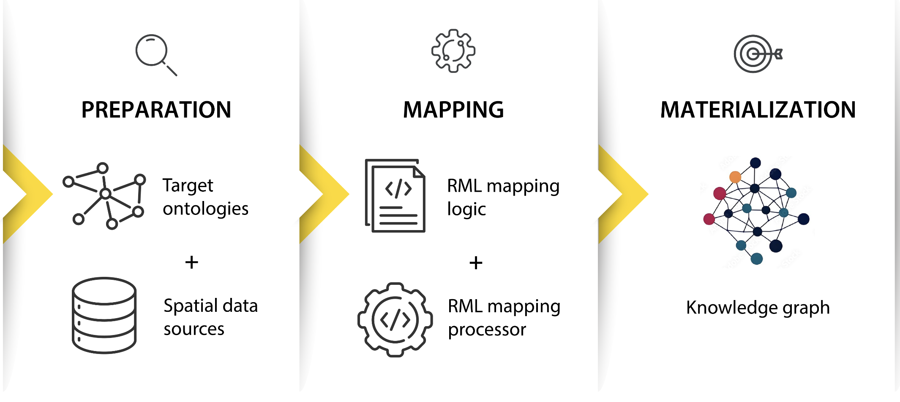

# Use case 2 - Australian placename data
The semantic enrichment approach uses [RML (RDF Mapping Language)](https://rml.io/specs/rml/) to construct two national placenames knowledge graphs from publicly available state-based placenames data: one based on the [Geoscience Australia Placenames Ontology](https://geoscienceaustralia.github.io/Placenames-Ontology/) and the other based on Spatial Information Queensland’s [Geographical Names Model](https://spatial-information-qld.github.io/geographical-names-model/model.html).

## Directory structure

- **data**: Folder with data from official gazetteers and place names.
- **images**: Contains diagrams, and other visual resources associated with the use case.
- **src**: RML mapping rules for enriching Place Name Data.
- **results**: Contains the generated knowledge graphs

## Data
- Data downloaded from authoritative organisations (state) for NSW, QLD, SA and VIC.
- For ACT, NT, WA and TAS place names gazetteers were downloaded from the national database, the [Composite Gazetteer of Australia](https://placenames.fsdf.org.au/). 


## Place Name ontology
The image below provides an overview of the main classes and object properties defined in the [Geoscience Australia Place Name ontology](https://geoscienceaustralia.github.io/Placenames-Ontology/placenames.html).
<p align="center">
  
</p>

## Geographical Names Model
The image below provides an overview of the main classes and object properties defined in the [Geographical Names Model](https://spatial-information-qld.github.io/geographical-names-model/model.html).
<p align="center">
  
</p>

## Semantic Enrichment Process
<p align="center">
  
</p>

## RML mapping and processing
RML mapping rules are written and included in [1](src/RMLMappings_PNO.ttl) and [2](src/RMLMappings_GNModel.ttl). 
The data source paths specified in the RML mapping file must be updated to match the corresponding file paths on your local machine.
Example: 
```turtle
<#ACTSitesSource> a rml:LogicalSource;
      rml:source "../data/ACT2026Q1.csv";  
      rml:referenceFormulation ql:CSV .
```
Modify the execution command as needed, specifying the locations of the JAR file, mapping file, and the destination for the output file. 
Example:
```
java -jar rmlmapper-17.0.0-r449-all.jar -m ./src/RMLMappings_PNO.ttl -o pnkg_out.ttl
```
The PNKG in ttl file format will be created.
In this project, the knowledge graph was built using [RMLmapper-java](https://drive.google.com/file/d/1wOW44Nlq9NA_ie_twcSx6sEzHPKuc6qs/view?usp=drive_link). 

## Key resources 

- [Geoscience Australia Place Names Ontology](https://geoscienceaustralia.github.io/Placenames-Ontology/placenames.html);
- [Geoscience Australia Place-Names GitHub repository](https://github.com/GeoscienceAustralia/Placenames-Ontology);
- [Geographical Names Model](https://spatial-information-qld.github.io/geographical-names-model/model.html);
- [Composite Gazetteer of Australia](https://placenames.fsdf.org.au/);
- [Data Product Specification for the Composite Gazetteer of Australia](data/CompositeGazetteerDPS.pdf);
- [Linked Data API codebase for National Composite Gazetteer of Australia](https://github.com/GeoscienceAustralia/placenames-dataset); and
- [RML tools](https://rml.io/tools/)
- [RML: A Generic Language for Integrated RDF Mappings of Heterogeneous Data](https://citeseerx.ist.psu.edu/document?repid=rep1&type=pdf&doi=f0b98c4fc3a542a83349666f4073359ed56d1a17)
- [The RML Ontology: A Community-Driven Modular Redesign After a Decade of Experience in Mapping Heterogeneous Data to RDF](https://link.springer.com/content/pdf/10.1007/978-3-031-47243-5_9.pdf)

