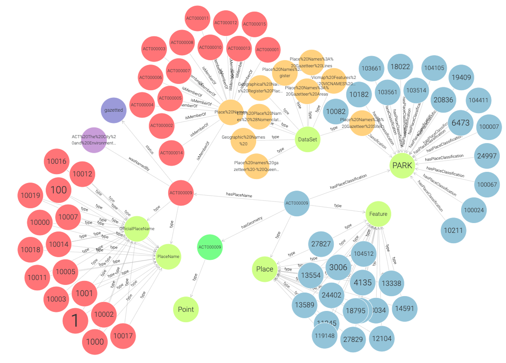
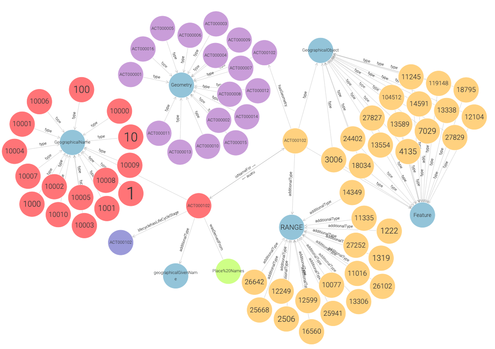

## Knowledge Graph Generated Using the Place Name Ontology 
This link provides access to download the [Knowledge Graph (KG)](https://drive.google.com/file/d/1DLvKPDYT73wji4RjRwkJXc21ht_b7jo1/view?usp=sharing), which integrates place-name data from all Australian states and territories.
The figure below shows a snapshot of a section of the Knowledge Graph.

  

## Knowledge Graph Generated Using the Geographical Names Model 
This link provides access to download the [Knowledge Graph (KG)](https://drive.google.com/file/d/1ONQjw-sG7HqN5ojujU3NZtswACI5b_q7/view?usp=drive_link), which integrates place-name data from all Australian states and territories.
The figure below shows a snapshot of a section of the Knowledge Graph.

  

