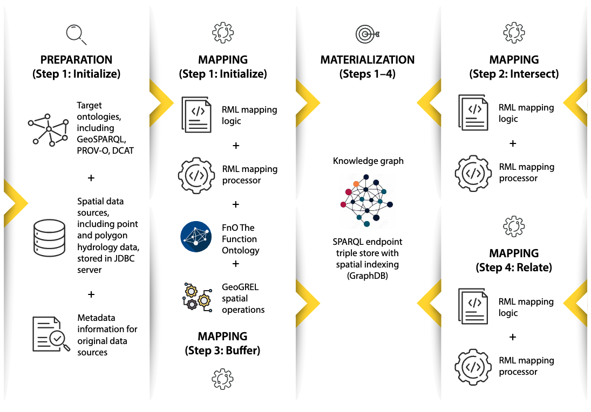

## Use case 3 - Victorian state hydrology foundation spatial data
This repository contains source code and datasets for transparent and reusable semantic data enrichment of Victorian state hydrology foundation spatial data. The approach uses [RML (RDF Mapping Language)](https://rml.io/specs/rml/) to enrich the Victorian hydrological spatial data sets.

## Repository structure

- **data**: Provides links to download the Victorian State Hydrology Foundation spatial datasets used in this use case.
- **images**: Contains diagrams, and other visual resources associated with the use case.
- **src**: Contains the RML mapping rules used to transform and semantically enrich the Victorian hydrology spatial data.
- **results**: Contains the generated knowledge graph

## Semantic enrichment process
<p align="center">
  
  <br>
  <strong> Figure : Four-step semantic enrichment process for Dynamic Vicmap hydrological spatial data</strong>
</p>

## RML mapping and processing

The RML mapping rules for the four-step semantic enrichment process are provided in [1](src/dvmMappingFlow_Step1_2026.ttl), [2](src/dvmMappingFlow_Step2_2026.ttl), [3](src/dvmMappingFlow_Step3_2026.ttl) and [4](src/dvmMappingFlow_Step4_2026.ttl).

Before starting the enrichment process, the PostgreSQL database, created using our [dataset](https://github.com/nayomirana/Declarative-semantic-enrichment-of-spatial-data/tree/main/Use%20case3/data), and the GraphDB triple store were set up on an _AWS EC2 r6i.2xlarge_ instance.

1.	Step 1: Accesses data from the PostgreSQL database (_dvm_). The generated RDF triples must be transferred to the knowledge graph stored in the _dvicmap_ triple store in GraphDB.
   After loading the RDF data into GraphDB, enable GeoSPARQL spatial indexing by executing the following SPARQL query in the dvicmap repository:
   ```
  PREFIX geosparql: <http://www.ontotext.com/plugins/geosparql#>
  INSERT DATA {
    [] geosparql:enabled "true" .
  }
   ```
3.	Step 2: Reads data from same triple store, and performs the second enrichment step, and writes the resulting triples back to the same triple store in GraphDB.
4.	Step 3: Performs the third enrichment step. The generated results must be transferred to the same triple store in GraphDB.
5.	Step 4: Performs the final enrichment step and stores the resulting triples in the same triple store in GraphDB.

In the mapping process, Steps 1 and 3 use functions declared in the [geofunctions.ttl](https://github.com/nayomirana/Declarative-semantic-enrichment-of-spatial-data/blob/main/Use%20case3/src/GeoGREL/geofunctions.ttl) file. Therefore, this file must be specified in the execution command.

```
java -Xms50g -Xmx62g \
  -jar rmlmapper-17.0.0-r449-all.jar \
  -m dvmMappingFlow_Step1_2026.ttl \
  -o dvm1.ttl \
  -s turtle \
  -f geofunctions.ttl
```
All four mapping files should be executed sequentially, one after another, to complete the semantic enrichment process.

## Key resources 
- **Research Paper:** [Semantic data enrichment for maintenance of foundation spatial data](https://www.sciencedirect.com/science/article/pii/S0198971526000128) - Computers, Environment and Urban Systems, Volume 126, 102410.
- [SMURF Ontology](https://rmit-gkl.github.io/SMURF/smurf.html)
- [RML tools](https://rml.io/tools/)
- [RML: A Generic Language for Integrated RDF Mappings of Heterogeneous Data](https://citeseerx.ist.psu.edu/document?repid=rep1&type=pdf&doi=f0b98c4fc3a542a83349666f4073359ed56d1a17)
- [The RML Ontology: A Community-Driven Modular Redesign After a Decade of Experience in Mapping Heterogeneous Data to RDF](https://link.springer.com/content/pdf/10.1007/978-3-031-47243-5_9.pdf)
